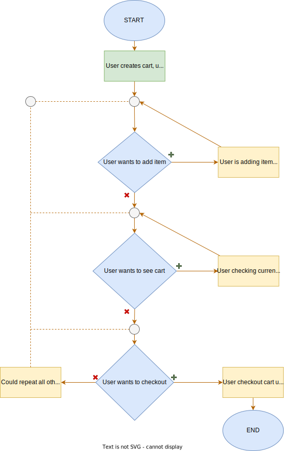

# Cart

In the cart module, users can create a cart, add products to it, proceed to checkout, delete items, and clear the cart. This operates in a simple manner, similar to how it is handled on shopping websites.

Base URL:

```
https://api.everrest.educata.dev/shop/cart
```

## Workflow



To use the cart module, we must follow a workflow similar to the provided flowchart. First of all, a user needs to create a cart by <a href="#create-cart">Create cart</a>. Then, the user is allowed to check the cart at any time by <a href="#get-cart">Get cart</a>. After that, if the user wants to add a new product to the cart, they should use the <a href="#update-cart">Update cart</a> option. There may be moments when the user wants to clear the cart, for this action, we will use the <a href="#clear-cart">Clear cart</a> option. If the user wants to remove an item from the cart, we should use the <a href="#delete-item">Delete item</a> option. Finally, if the user wants to proceed to checkout, we should use the <a href="#checkout">Checkout</a> option.

::: info NOTE
All endpoints for the cart module require the user to be `authorized`. This means that an access token must be attached either to cookies or the `Authorization` header.
:::

## Create cart

To create cart, user has to choose one time for first time.

- Method: `POST`
- URL: `https://api.everrest.dev/shop/cart/product`

### Body

- `id`: string
- `quantity`: number

### Example

```sh
curl -X 'POST' \
  'https://api.everrest.educata.dev/shop/cart/product' \
  -H 'accept: application/json' \
  -H 'Authorization: Bearer <your_token_here>' \
  -H 'Content-Type: application/json' \
  -d '{
  "id": "64edc5b96ad1cbae75d3025a",
  "quantity": 1
}'
```

### Response

```json
{
  "userId": "64eccb55fe7b573c1ec5aaae",
  "createdAt": "2023-09-27T04:38:43.442Z",
  "total": {
    "price": {
      "current": 1899,
      "beforeDiscount": 1899
    },
    "quantity": 1,
    "products": 1
  },
  "products": [
    {
      "quantity": 1,
      "pricePerQuantity": 1899,
      "beforeDiscountPrice": 1899,
      "productId": "64edc5b96ad1cbae75d3025a"
    }
  ],
  "_id": "6513b1d325316704e705e10f"
}
```

::: info NOTE
This endpoint works if the user does not have a cart attached.
:::

## Get cart

- Method: `GET`
- URL: `https://api.everrest.dev/shop/cart`

### Example

```sh
curl -X 'GET' \
  'https://api.everrest.educata.dev/shop/cart' \
  -H 'accept: application/json' \
  -H 'Authorization: Bearer <your_token_here>'
```

### Response

```json
{
  "total": {
    "price": {
      "current": 1899,
      "beforeDiscount": 1899
    },
    "quantity": 1,
    "products": 1
  },
  "_id": "6513b1d325316704e705e10f",
  "userId": "64eccb55fe7b573c1ec5aaae",
  "createdAt": "2023-09-27T04:38:43.442Z",
  "products": [
    {
      "quantity": 1,
      "pricePerQuantity": 1899,
      "beforeDiscountPrice": 1899,
      "productId": "64edc5b96ad1cbae75d3025a"
    }
  ]
}
```

## Update cart

- Method: `PATCH`
- URL: `https://api.everrest.dev/shop/cart/product`

### Body

- `id`: string
- `quantity`: number

### Example

```sh
curl -X 'PATCH' \
  'https://api.everrest.educata.dev/shop/cart/product' \
  -H 'accept: application/json' \
  -H 'Authorization: Bearer <your_token_here>' \
  -H 'Content-Type: application/json' \
  -d '{
  "id": "64edc5b96ad1cbae75d30262",
  "quantity": 1
}'
```

### Response

```json
{
  "total": {
    "price": {
      "current": 2998,
      "beforeDiscount": 2998
    },
    "quantity": 2,
    "products": 2
  },
  "_id": "6513b1d325316704e705e10f",
  "userId": "64eccb55fe7b573c1ec5aaae",
  "createdAt": "2023-09-27T04:38:43.442Z",
  "products": [
    {
      "quantity": 1,
      "pricePerQuantity": 1899,
      "beforeDiscountPrice": 1899,
      "productId": "64edc5b96ad1cbae75d3025a"
    },
    {
      "quantity": 1,
      "pricePerQuantity": 1099,
      "beforeDiscountPrice": 1099,
      "productId": "64edc5b96ad1cbae75d30262"
    }
  ]
}
```

::: info NOTE
This endpoint works if the user already have a cart attached.
:::

## Clear cart

- Method: `DELETE`
- URL: `https://api.everrest.dev/shop/cart`

### Example

```sh
curl -X 'DELETE' \
  'https://api.everrest.educata.dev/shop/cart' \
  -H 'accept: */*' \
  -H 'Authorization: Bearer <your_token_here>'
```

### Response

```json
{
  "success": true
}
```

## Delete item

- Method: `DELETE`
- URL: `https://api.everrest.dev/shop/cart/product`

### Body

- `id`: string

### Example

```sh
curl -X 'DELETE' \
  'https://api.everrest.educata.dev/shop/cart/product' \
  -H 'accept: application/json' \
  -H 'Authorization: Bearer <your_token_here>' \
  -H 'Content-Type: application/json' \
  -d '{
  "id": "64edc5b96ad1cbae75d30262"
}'
```

### Response

```json
{
  "total": {
    "price": {
      "current": 0,
      "beforeDiscount": 0
    },
    "quantity": 0,
    "products": 0
  },
  "_id": "6513c4c325316704e705e134",
  "userId": "64eccb55fe7b573c1ec5aaae",
  "createdAt": "2023-09-27T05:59:31.014Z",
  "products": [],
  "__v": 1
}
```

## Checkout

- Method: `POST`
- URL: `https://api.everrest.dev/shop/cart/checkout`

### Example

```sh
curl -X 'POST' \
  'https://api.everrest.educata.dev/shop/cart/checkout' \
  -H 'accept: */*' \
  -H 'Authorization: Bearer <your_token_here>' \
  -d ''
```

### Response

```json
{
  "success": true,
  "message": "Stocks were updated, currently 1 items were sold. The cart will be cleared, user has to create a new cart with POST request"
}
```
